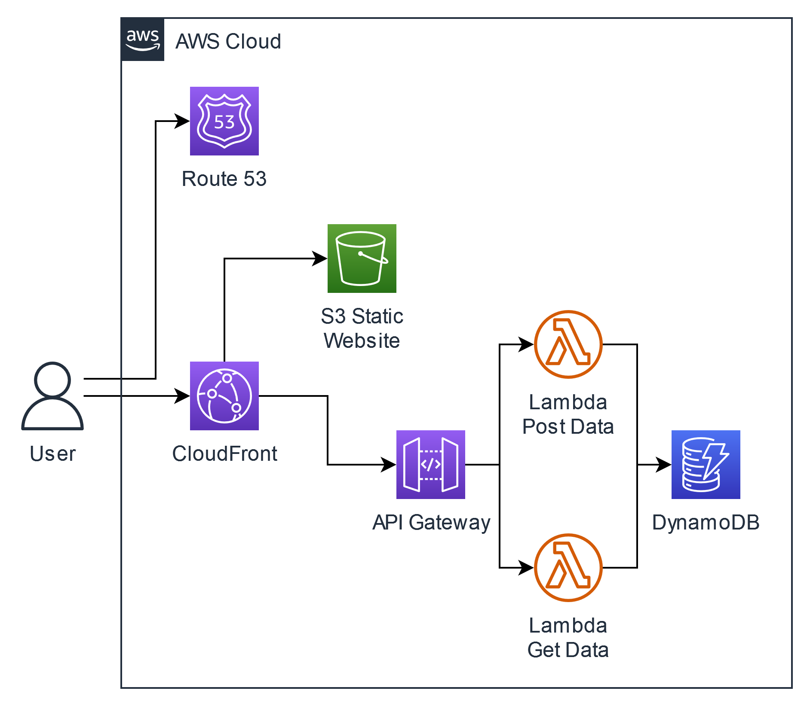

import { useState, useEffect } from "react";

export const Views = () => {
  const [data, setData] = useState(null);
  useEffect(() => {
    fetch("api/views", {
      method: "POST",
      mode: "same-origin",
      cache: "no-cache",
      headers: {
        "Content-Type": "application/json",
      },
    })
      .then((response) => response.json())
      .then((json) => setData(json))
      .catch((error) => console.error(error));
  }, []);
  if (!data) {
    return "Fetching views...";
  }
  return data;
};

## About

Hello! My name is Patrick, and I am a DevOps engineer deeply interested
in automating secure, reliable, scalable, and cost-effective infrastructure.
I am skilled in managing Terraform, CI/CD, AWS, Kubernetes, and more.
Please feel free to check out my resume and posts!

### Hit Count

Current hit count of this about page: **<Views />**

### This Project

This website is an implementation of the
[Cloud Resume Challenge](https://cloudresumechallenge.dev/). As part of this,
this static website using Next.js is hosted in an S3 bucket. The hit counter
uses API Gateway, Lambda functions programmed in Go, and a DynamoDB table.
All of this is deployed using Terraform and automated and tested using
GitHub Actions for CI/CD. You can read more about the project by reading
my [blog posts](/posts).

<figcaption>Diagram of the implemented AWS architecture.</figcaption>

---

  
[GitHub](https://github.com/nelsen129)

  
[LinkedIn](https://www.linkedin.com/in/patrick-nelsen-0708a1201/)

  
Email patrick@patricknelsen.com

